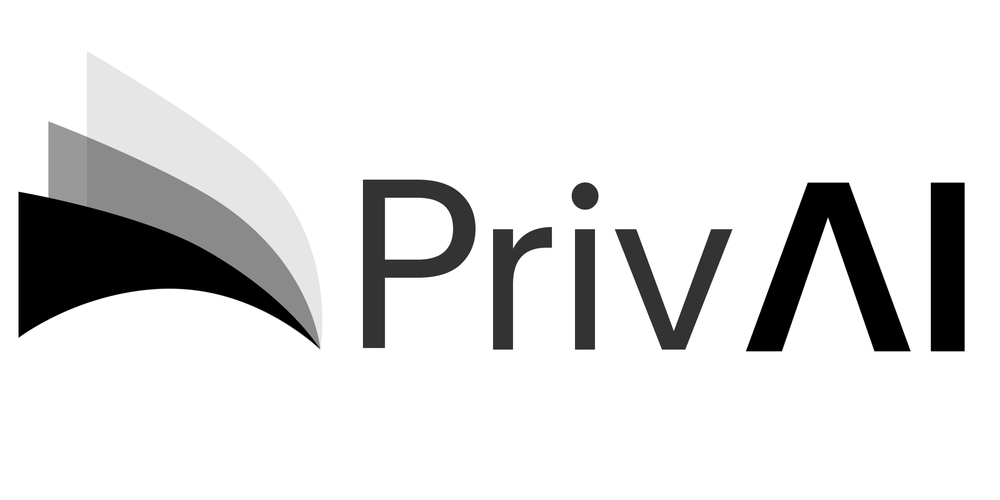

<p align="right">
  
  
  
  
</p>

<p align="center">
  
</p>

<h1 align="center">PrivAI</h1>

<p align="center">
  <strong>Government-first visual privacy firewall for identity documents and live visual streams.</strong>
</p>

<p align="center">
  <a href="https://privai-frontend.orangebeach-03038aed.southeastasia.azurecontainerapps.io"><strong>Live Demo</strong></a>
  &middot;
  <a href="https://privai-backend.orangebeach-03038aed.southeastasia.azurecontainerapps.io/docs"><strong>API Docs</strong></a>
  &middot;
  <a href="https://privai-backend.orangebeach-03038aed.southeastasia.azurecontainerapps.io/api/health"><strong>Backend Health</strong></a>
</p>

PrivAI adalah aplikasi **visual privacy firewall** berbasis AI untuk mendeteksi dan meredaksi data identitas sensitif pada dokumen dan live visual stream. Aplikasi ini dirancang untuk skenario **Smart Governance / Public Service**, dengan alur keamanan yang memisahkan hasil redaksi operasional dan original terenkripsi.

PrivAI memproses gambar menggunakan YOLO lokal, menyimpan hasil redaksi di **Operational Zone**, menyimpan original terenkripsi di **Sovereign Vault**, dan menyediakan **Government Access API** untuk membuka original hanya melalui request, approval, one-time token, dan audit log.

## Repository About

| Field | Value |
|---|---|
| Description | Government-first visual privacy firewall for detecting, redacting, and securely governing sensitive identity data with local YOLO inference, Sovereign Vault encryption, Dynamic Injection policy, and audit logs. |
| Website | https://privai-frontend.orangebeach-03038aed.southeastasia.azurecontainerapps.io |
| Topics | `privai`, `privacy`, `fastapi`, `react`, `yolo`, `computer-vision`, `redaction`, `smart-governance`, `sovereign-vault`, `audit-log`, `azure-container-apps` |

## Demo Online

| Komponen | URL |
|---|---|
| Frontend | `https://privai-frontend.orangebeach-03038aed.southeastasia.azurecontainerapps.io` |
| Backend API | `https://privai-backend.orangebeach-03038aed.southeastasia.azurecontainerapps.io` |
| API Docs | `https://privai-backend.orangebeach-03038aed.southeastasia.azurecontainerapps.io/docs` |
| Health Check | `https://privai-backend.orangebeach-03038aed.southeastasia.azurecontainerapps.io/api/health` |

## Fitur Utama

| Fitur | Penjelasan |
|---|---|
| Document Privacy Shield | Upload dokumen identitas, deteksi data sensitif, dan hasilkan gambar redacted. |
| Local YOLO Inference | Deteksi objek sensitif memakai model YOLO `.pt` lokal tanpa cloud AI API. |
| Visual Redaction | Mendukung mode `black_box`, `blur`, dan `pixelate`. |
| Performance Mode | Mode `fast`, `balanced`, dan `robust` untuk mengatur tradeoff kecepatan dan verifikasi. |
| Per-Class Confidence | Threshold deteksi bisa berbeda untuk tiap class agar kelas kuat/lemah bisa dikalibrasi. |
| Authenticity Guardrail | Validasi post-processing untuk membedakan dokumen resmi dari gambar tangan/sketsa/palsu. |
| Operational Zone | Menyimpan output redacted dan metadata non-private. |
| Sovereign Vault | Menyimpan original sebagai encrypted bundle dengan AES-256-GCM dan RSA-OAEP-SHA256. |
| Key Rotation | Rotasi vault key untuk upload baru tanpa menghapus key lama. |
| Government Access API | Request, approval, one-time token, dan secure original download. |
| Dynamic Injection | Runtime policy untuk mengatur class aktif, mode redaksi, confidence, dan label tanpa restart backend. |
| Audit Log | Mencatat event redaksi, vault encryption, policy update, approval, dan original decryption. |
| Live Stream Track | Redaksi frame/live camera secara ephemeral untuk secondary track. |

## Class Deteksi

| Class | Keterangan |
|---|---|
| `KTP` | Kartu Tanda Penduduk. |
| `SIM` | Surat Izin Mengemudi. |
| `Paspor` | Paspor. |
| `NIK_Teks` | Nomor identitas atau teks NIK. |
| `Wajah` | Wajah pada dokumen atau kamera. |
| `Plat_Nomor` | Plat nomor kendaraan. |

Default threshold per class:

| Class | Default Confidence |
|---|---:|
| `KTP` | `0.35` |
| `SIM` | `0.35` |
| `Paspor` | `0.35` |
| `NIK_Teks` | `0.30` |
| `Wajah` | `0.25` |
| `Plat_Nomor` | `0.35` |

## Arsitektur Sistem

```text
User Zone
  -> Local YOLO inference
  -> Performance preset / document TTA
  -> Authenticity guardrail
  -> Visual redaction
  -> Operational Zone: redacted output + non-private metadata
  -> Sovereign Vault: encrypted original bundle
  -> Government Access API: controlled original retrieval
  -> Audit Log: security event trace
```

## Zona Keamanan

| Zona | Isi | Catatan |
|---|---|---|
| User Zone | Upload dokumen, preview hasil, live stream UI. | Tempat user berinteraksi dengan aplikasi. |
| Operational Zone | Redacted image dan metadata non-private. | Tidak menyimpan original plaintext. |
| Sovereign Vault | Original terenkripsi, wrapped DEK, key metadata. | Original hanya dibuka lewat Government Access API. |
| Government Access | Request, approval, one-time token, secure viewer. | Token hanya berlaku sekali dan dicatat audit. |
| Audit Log | Event keamanan dan aktivitas sistem. | Dipakai untuk traceability. |

## Redaction Pipeline

```text
1. User upload image
2. Backend validasi file dan decode image
3. Runtime/manual policy di-resolve
4. YOLO mendeteksi kandidat class sensitif
5. Guardrail memvalidasi kandidat detection
6. Redaction service menerapkan black box / blur / pixelate
7. Hasil redacted disimpan ke Operational Zone
8. Original dienkripsi dan disimpan ke Sovereign Vault
9. Metadata dan audit log disimpan ke SQLite
10. Frontend menampilkan hasil dan ringkasan deteksi
```

## Performance Mode

| Mode | Perilaku | Cocok Untuk |
|---|---|---|
| `fast` | 1x inference, tanpa OCR, tanpa TTA berat. | Demo cepat. |
| `balanced` | TTA `0,180`, tanpa OCR default. | Dokumen normal dan upside-down. |
| `robust` | TTA lebih lengkap dan OCR-capable guardrail. | Dokumen sulit atau verifikasi lebih ketat. |

## Dynamic Injection Policy

Dynamic Injection adalah konfigurasi runtime yang tervalidasi. Policy dapat mengatur:

- nama policy
- profile redaksi
- mode redaksi
- confidence global
- confidence per class
- active classes
- disabled classes
- label text

Contoh konsep policy:

```json
{
  "policy_name": "Default Government Policy",
  "confidence_threshold": 0.35,
  "class_confidence_threshold": {
    "KTP": 0.35,
    "SIM": 0.35,
    "Paspor": 0.35,
    "NIK_Teks": 0.30,
    "Wajah": 0.25,
    "Plat_Nomor": 0.35
  },
  "profile": "government",
  "redaction_mode": "black_box",
  "active_classes": ["KTP", "SIM", "Paspor", "NIK_Teks", "Wajah", "Plat_Nomor"],
  "disabled_classes": [],
  "label_text": "REDACTED"
}
```

## Government Access Flow

```text
1. Dokumen diproses dan menghasilkan record_id
2. Instansi pemerintah membuat access request
3. Approver menyetujui request
4. Backend menerbitkan one-time access token
5. Token dipakai untuk membuka original dari Sovereign Vault
6. Token langsung ditandai used
7. Audit Log mencatat seluruh proses
```

Demo token default:

```text
GOVERNMENT_TOKEN=privai-government-demo-token
APPROVER_TOKEN=privai-approver-demo-token
CRYPTO_ADMIN_TOKEN=privai-crypto-admin-demo-token
```

## Tech Stack

### Backend

- Python 3.11
- FastAPI
- Uvicorn
- SQLAlchemy
- SQLite
- Ultralytics YOLO
- OpenCV
- NumPy
- Pillow
- cryptography
- pydantic-settings
- EasyOCR

### Frontend

- React
- TypeScript
- Vite
- Lucide React
- CSS custom styling
- nginx for production container serving

### Deployment

- Docker
- Azure Container Registry
- Azure Container Apps

## Struktur Folder

```text
PrivAI/
|-- backend/
|   |-- app/
|   |   |-- ai/              # YOLO detector, runtime loader, class map
|   |   |-- api/             # FastAPI routers
|   |   |-- core/            # config, redaction policy, runtime policy
|   |   |-- db/              # SQLite models and repositories
|   |   |-- services/        # redaction, vault, access, audit, guardrail, live
|   |   `-- utils/           # image, file, hash, time utilities
|   |-- models/              # YOLO .pt model
|   |-- storage/             # SQLite DB, vault, redacted output, runtime policy
|   |-- requirements.txt
|   `-- Dockerfile
|-- frontend/
|   |-- src/
|   |   |-- assets/          # logos and visual assets
|   |   |-- components/      # reusable UI components
|   |   |-- layouts/         # app shells
|   |   |-- lib/             # API client and helpers
|   |   |-- views/           # user and government pages
|   |   `-- styles.css
|   |-- nginx.conf
|   |-- Dockerfile
|   `-- package.json
|-- doc/
|-- research/
`-- README.md
```

## Menjalankan Lokal

### Backend

```powershell
cd D:\PrivAI\backend
py -3.11 -m venv .venv
.\.venv\Scripts\Activate.ps1
pip install -r requirements.txt
copy .env.example .env
uvicorn app.main:app --reload --host 127.0.0.1 --port 8000
```

Backend lokal:

```text
http://127.0.0.1:8000
http://127.0.0.1:8000/docs
```

### Frontend

```powershell
cd D:\PrivAI\frontend
npm install
npm run dev
```

Frontend lokal:

```text
http://localhost:5173
```

## Environment Penting

Backend example:

```env
APP_NAME=PrivAI
MODEL_PATH=./models/privai_epoch50.pt
MODEL_CONFIDENCE=0.35
MODEL_DEVICE=cpu
DATABASE_URL=sqlite:///./storage/privai.db
RUNTIME_POLICY_PATH=./storage/config/runtime_policy.json
CORS_ORIGINS=http://localhost:5173,http://127.0.0.1:5173
```

Frontend development:

```env
VITE_API_PROXY_TARGET=http://127.0.0.1:8000
```

Frontend production:

```env
VITE_API_BASE_URL=https://privai-backend.orangebeach-03038aed.southeastasia.azurecontainerapps.io
```

## Endpoint Inti

| Method | Endpoint | Fungsi |
|---|---|---|
| GET | `/api/health` | Status backend, model, storage, database. |
| GET | `/api/model-info` | Info model dan class deteksi. |
| GET | `/api/redaction-config` | Profile, mode, dan class redaksi. |
| POST | `/api/redact` | Upload dan redaksi dokumen. |
| GET | `/api/storage/records` | Data Operational Zone. |
| GET | `/api/crypto/key-info` | Info active vault key. |
| POST | `/api/crypto/rotate-vault-key` | Rotasi vault key. |
| GET | `/api/vault/records/{record_id}` | Metadata encrypted original. |
| GET | `/api/runtime-policy` | Lihat Dynamic Injection policy. |
| PUT | `/api/runtime-policy` | Update Dynamic Injection policy. |
| POST | `/api/runtime-policy/reset` | Reset policy default. |
| POST | `/api/government/access-requests` | Buat access request. |
| POST | `/api/government/access-requests/{request_id}/approve` | Approve request. |
| GET | `/api/government/access-requests/{request_id}/secure-original` | Download original dengan one-time token. |
| GET | `/api/audit-logs` | Lihat audit log. |
| POST | `/api/live/redact-frame` | Redaksi satu frame ephemeral. |
| POST | `/api/live/turbo/start` | Start live stream backend camera. |
| POST | `/api/live/turbo/stop` | Stop live stream. |
| GET | `/api/live/turbo/status` | Status live stream. |
| GET | `/api/live/turbo/mjpeg` | MJPEG redacted stream. |

## Quick Test

Backend health:

```powershell
curl.exe http://127.0.0.1:8000/api/health
```

Online health:

```powershell
curl.exe https://privai-frontend.orangebeach-03038aed.southeastasia.azurecontainerapps.io/api/health
```

Upload redaction lokal:

```powershell
curl.exe -X POST "http://127.0.0.1:8000/api/redact?profile=government&performance_mode=fast" `
  -F "file=@D:\PrivAI\sample\test.jpg"
```
